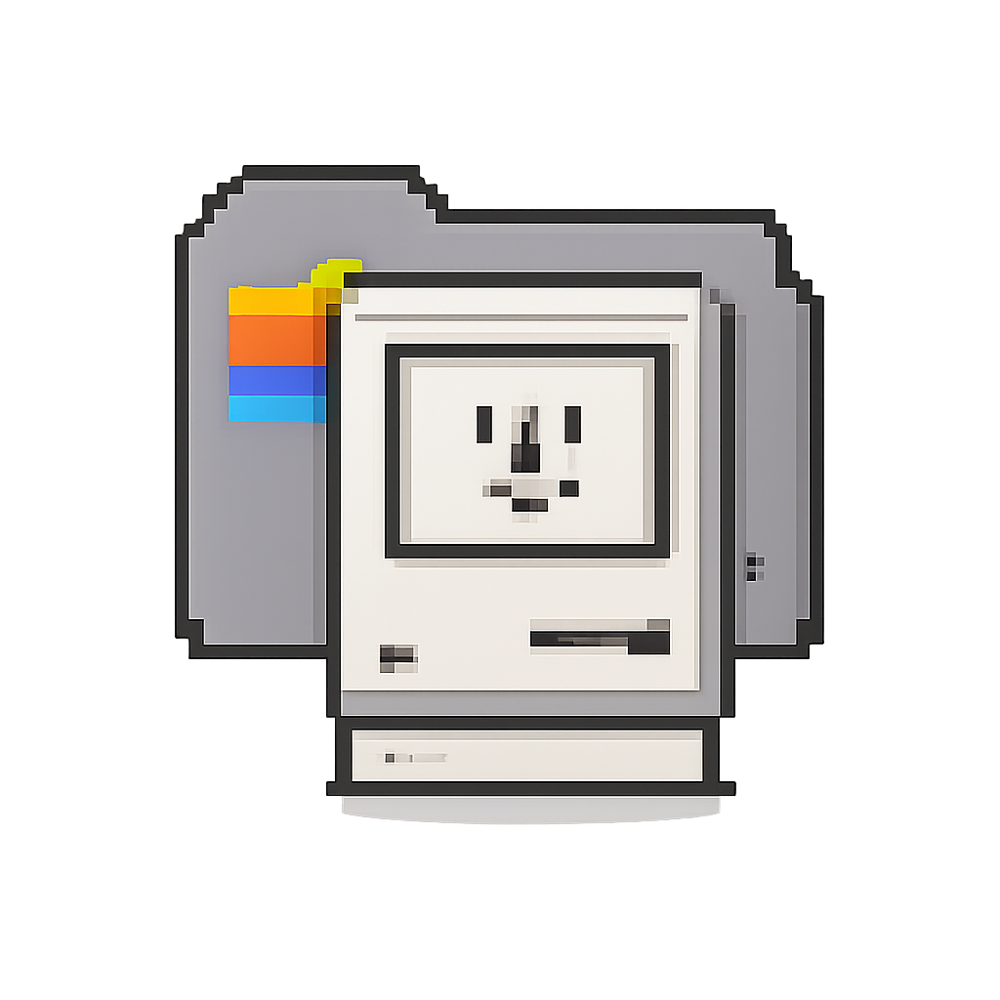

# Macintosh Portfolio 1984

<div align="center">
  
</div>

一个 1980 年代早期 Apple Macintosh 风格的响应式个人主页。

## 特性

- 🖥️ 桌面端：完整 Macintosh 桌面体验（菜单栏、可拖拽窗口、桌面图标）
- 📱 移动端：Tab 导航的单窗口分页界面
- ⚙️ JSON 配置文件：编辑 config.json 即可更新所有内容
- 🌐 自动语言：首次访问时按 IP 国家码选择语言，中国大陆显示中文，其他地区显示英文
- ✍️ 博客：Markdown 源文生成静态文章页，并自动更新首页 Blog 窗口
- 🎨 1-bit 黑白设计：纯复古风格，无渐变和玻璃效果
- ⌨️ 键盘快捷键：Esc 关闭窗口，Tab 切换窗口

## 快速开始

### 方法 1: 本地测试（推荐）

由于浏览器安全限制，需要通过 HTTP 服务器访问（不能用 file://）：

```bash
# Python 3
python3 -m http.server 8000

# Node.js
npx serve

# PHP
php -S localhost:8000
```

然后访问：http://localhost:8000

## 博客写作

新增文章时，在 `blog/posts/` 下创建一个 Markdown 文件。文件名就是 URL slug，例如：

```bash
blog/posts/my-debug-note.md
```

文章需要包含 front matter：

```markdown
---
title: English list title
displayTitle: 中文文章标题
date: 2026-05-07
excerpt: One short sentence for the desktop Blog window.
tags: macOS, Swift, Debugging
---
```

正文支持常用 Markdown：段落、`##`/`###` 标题、无序列表、引用、代码块、行内代码和链接。

生成博客静态页：

```bash
node scripts/build-blog.mjs
```

脚本会自动完成：

- 生成 `blog/<slug>.html`
- 更新 `blog/index.html` 到最新文章
- 更新 `config.json` 里的 `blogPosts`
- 刷新 `index.html` 里的 `CONFIG_VERSION`，避免浏览器缓存旧配置

### 方法 2: 直接打开（功能受限）

直接双击 `index.html` 也可以打开，但会看到配置加载错误提示，显示的是默认内容。

## 配置说明

所有内容都在 `config.json` 中配置：

```json
{
  "site": {
    "title": "My Macintosh",
    "menuLogo": "My Macintosh",
    "menuItems": ["File", "Edit", "View", "Special", ""]
  },
  "profile": {
    "name": "Your Name",
    "avatar": "👤",
    "bio": "个人简介",
    "background": "背景介绍",
    "skills": ["JavaScript", "Python", "React"]
  },
  "projects": [
    {
      "title": "项目名称",
      "icon": "🎨",
      "description": "项目描述",
      "year": "2024",
      "link": "https://..."
    }
  ]
}
```

### 配置项说明

| 字段 | 说明 |
|------|------|
| `site` | 网站基本信息（标题、菜单栏） |
| `profile` | 个人资料（头像、简介、技能） |
| `projects` | 项目列表 |
| `writings` | 文章列表 |
| `blogPosts` | 博客列表，由 `scripts/build-blog.mjs` 自动维护 |
| `notes` | 便签（支持文本和列表两种类型） |
| `contact` | 联系方式（社交媒体、表单开关） |
| `links` | 友情链接（分组） |
| `desktop` | 桌面图标和默认打开窗口 |

## 语言选择

首页按以下优先级选择语言：

1. URL 参数 `?lang=en` 或 `?lang=zh`
2. 用户通过页面语言按钮保存的选择
3. 首次访问时通过 `api.country.is` 查询 IP 国家码；`CN` 使用中文，其他国家或查询失败使用英文

IP 查询设置了短超时，不会持续阻塞页面。手动选择语言后，站点会将偏好保存在浏览器 `localStorage`，之后不再发起 IP 查询。

## 部署

部署到 `server94`：

```bash
./scripts/deploy-server94.sh
```

该脚本会先构建博客，然后同步整个静态站点到 `server94:/home/ubuntu/main-page`。

也可以上传到任意静态托管服务：

- **GitHub Pages**: 推送到仓库，在 Settings 中启用 Pages
- **Netlify**: 拖拽文件夹到 netlify.com
- **Vercel**: 连接 GitHub 仓库或拖拽部署
- **Cloudflare Pages**: 连接 Git 仓库

只需要上传：
- `index.html`
- `config.json`
- `favicon.png`（网站图标）
- `blog/`（博客文章和模板源文）

## 自定义样式

如果需要修改样式，编辑 `<style>` 标签中的 CSS 变量：

```css
:root {
    --color-black: #000000;
    --color-white: #ffffff;
    --font-size-md: 12px;
    --border-width-thick: 4px;
    /* ... 更多变量 */
}
```

## 键盘快捷键

| 快捷键 | 功能 |
|--------|------|
| `Esc` | 关闭当前窗口 |
| `Tab` | 切换到下一个窗口（仅桌面端） |
| `Cmd/Ctrl + W` | 关闭当前窗口 |

## 文件结构

```
.
├── index.html      # 主页面（包含所有样式和脚本）
├── config.json     # 配置文件（编辑这个更新内容）
├── blog/
│   ├── posts/      # 博客 Markdown 源文
│   ├── templates/  # 博客 HTML 模板
│   └── *.html      # 生成后的文章页面
├── scripts/
│   ├── build-blog.mjs
│   └── deploy-server94.sh
├── favicon.png     # 网站图标
├── AGENTS.md       # 给后续 agent 的维护说明
└── README.md       # 说明文档
```

## 浏览器兼容性

- Chrome/Edge: ✅
- Firefox: ✅
- Safari: ✅
- 移动浏览器: ✅

## 常见问题

### Q: 为什么直接打开 HTML 看不到内容？
A: 浏览器的安全策略限制了 `file://` 协议的 fetch 请求。请使用 HTTP 服务器。

### Q: 如何添加更多项目？
A: 在 `config.json` 的 `projects` 数组中添加新对象即可。

### Q: 如何添加博客文章？
A: 在 `blog/posts/` 新建 Markdown，运行 `node scripts/build-blog.mjs`。

### Q: 如何禁用联系表单？
A: 设置 `"formEnabled": false`

### Q: 如何修改默认打开的窗口？
A: 修改 `desktop.defaultOpenWindow` 为对应的窗口 ID（如 `"projects-window"`）

## License

MIT

---

Made with ❤️ in 2024
